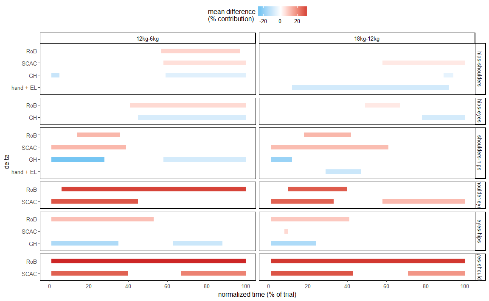

article-contribution
================
Romain Martinez
January 23, 2017

Tableau ANOVA delta
===================

| delta     | effect        |  df1|   df2|  h0reject|      p|  start|  end|
|:----------|:--------------|----:|-----:|---------:|------:|------:|----:|
| hand + EL | sexe          |    1|  1488|         1|  0.001|      0|   24|
| hand + EL | sexe          |    1|  1488|         1|  0.000|     62|  100|
| hand + EL | hauteur       |    5|  1488|         1|  0.000|      0|  100|
| hand + EL | poids         |    1|  1488|         1|  0.000|      0|  100|
| hand + EL | sexe-hauteur  |    5|  1488|         1|  0.010|     77|   83|
| hand + EL | sexe-hauteur  |    5|  1488|         1|  0.009|     94|  100|
| hand + EL | sexe-poids    |    1|  1488|         1|  0.001|     11|   28|
| hand + EL | sexe-poids    |    1|  1488|         1|  0.009|     68|   75|
| hand + EL | hauteur-poids |    5|  1488|         1|  0.000|      0|   25|
| hand + EL | hauteur-poids |    5|  1488|         1|  0.000|     55|  100|
| GH        | sexe          |    1|  1488|         1|  0.000|      0|  100|
| GH        | hauteur       |    5|  1488|         1|  0.000|      0|  100|
| GH        | poids         |    1|  1488|         1|  0.000|      0|  100|
| GH        | sexe-hauteur  |    5|  1488|         1|  0.000|      5|   22|
| GH        | sexe-hauteur  |    5|  1488|         1|  0.009|     86|   97|
| GH        | sexe-poids    |    1|  1488|         1|  0.008|     67|   71|
| GH        | hauteur-poids |    5|  1488|         1|  0.000|      5|  100|
| SCAC      | sexe          |    1|  1488|         1|  0.000|      0|  100|
| SCAC      | hauteur       |    5|  1488|         1|  0.000|      0|  100|
| SCAC      | poids         |    1|  1488|         1|  0.000|     21|   38|
| SCAC      | poids         |    1|  1488|         1|  0.000|     55|   94|
| SCAC      | sexe-hauteur  |    5|  1488|         1|  0.000|      0|  100|
| SCAC      | hauteur-poids |    5|  1488|         1|  0.013|     32|   33|
| SCAC      | hauteur-poids |    5|  1488|         1|  0.000|     54|   67|
| RoB       | sexe          |    1|  1488|         1|  0.000|      0|  100|
| RoB       | hauteur       |    5|  1488|         1|  0.000|      0|  100|
| RoB       | poids         |    1|  1488|         1|  0.002|     53|   94|
| RoB       | sexe-hauteur  |    5|  1488|         1|  0.000|      0|  100|

Tableau post-hoc delta
======================

| delta     | height         | weight    |  df1|  df2|  h0reject|      p|  start|  end|     diff| sens         |
|:----------|:---------------|:----------|----:|----:|---------:|------:|------:|----:|--------:|:-------------|
| hand + EL | hips-shoulders | 18kg-12kg |    1|  124|         1|  0.000|     12|   92|   -9.192| women&gt;men |
| hand + EL | shoulders-hips | 18kg-12kg |    1|  124|         1|  0.000|     29|   47|  -10.611| women&gt;men |
| GH        | hips-shoulders | 12kg-6kg  |    1|  124|         1|  0.001|      1|    5|  -11.248| women&gt;men |
| GH        | hips-shoulders | 12kg-6kg  |    1|  124|         1|  0.000|     59|  100|   -6.372| women&gt;men |
| GH        | hips-eyes      | 12kg-6kg  |    1|  124|         1|  0.000|     45|  100|   -8.192| women&gt;men |
| GH        | hips-shoulders | 18kg-12kg |    1|  124|         1|  0.001|     89|   94|   -5.188| women&gt;men |
| GH        | hips-eyes      | 18kg-12kg |    1|  124|         1|  0.000|     78|  100|   -8.786| women&gt;men |
| GH        | shoulders-hips | 12kg-6kg  |    1|  124|         1|  0.000|      1|   28|  -25.486| women&gt;men |
| GH        | shoulders-hips | 12kg-6kg  |    1|  124|         1|  0.000|     58|  100|   -8.779| women&gt;men |
| GH        | eyes-hips      | 12kg-6kg  |    1|  124|         1|  0.000|      1|   35|  -16.215| women&gt;men |
| GH        | eyes-hips      | 12kg-6kg  |    1|  124|         1|  0.000|     63|   88|  -10.667| women&gt;men |
| GH        | shoulders-hips | 18kg-12kg |    1|  124|         1|  0.000|      1|   12|  -19.695| women&gt;men |
| GH        | eyes-hips      | 18kg-12kg |    1|  124|         1|  0.000|      1|   24|  -16.042| women&gt;men |
| SCAC      | hips-shoulders | 12kg-6kg  |    1|  124|         1|  0.000|     58|  100|    5.381| men&gt;women |
| SCAC      | shoulder-eyes  | 12kg-6kg  |    1|  124|         1|  0.000|      1|   45|   28.541| men&gt;women |
| SCAC      | hips-shoulders | 18kg-12kg |    1|  124|         1|  0.000|     58|  100|    3.752| men&gt;women |
| SCAC      | shoulder-eyes  | 18kg-12kg |    1|  124|         1|  0.000|      1|   33|   26.725| men&gt;women |
| SCAC      | shoulder-eyes  | 18kg-12kg |    1|  124|         1|  0.000|     58|  100|   12.044| men&gt;women |
| SCAC      | shoulders-hips | 12kg-6kg  |    1|  124|         1|  0.000|      1|   39|   12.266| men&gt;women |
| SCAC      | eyes-shoulder  | 12kg-6kg  |    1|  124|         1|  0.000|      1|   40|   26.916| men&gt;women |
| SCAC      | eyes-shoulder  | 12kg-6kg  |    1|  124|         1|  0.000|     67|  100|   21.541| men&gt;women |
| SCAC      | shoulders-hips | 18kg-12kg |    1|  124|         1|  0.000|      1|   61|   11.474| men&gt;women |
| SCAC      | eyes-hips      | 18kg-12kg |    1|  124|         1|  0.001|      8|   10|    6.555| men&gt;women |
| SCAC      | eyes-shoulder  | 18kg-12kg |    1|  124|         1|  0.000|      1|   43|   28.715| men&gt;women |
| SCAC      | eyes-shoulder  | 18kg-12kg |    1|  124|         1|  0.000|     71|  100|   18.036| men&gt;women |
| RoB       | hips-shoulders | 12kg-6kg  |    1|  124|         1|  0.000|     57|   97|    7.339| men&gt;women |
| RoB       | hips-eyes      | 12kg-6kg  |    1|  124|         1|  0.000|     41|  100|    6.378| men&gt;women |
| RoB       | shoulder-eyes  | 12kg-6kg  |    1|  124|         1|  0.000|      6|  100|   31.279| men&gt;women |
| RoB       | hips-eyes      | 18kg-12kg |    1|  124|         1|  0.000|     49|   67|    3.807| men&gt;women |
| RoB       | hips-eyes      | 18kg-12kg |    1|  124|         1|  0.001|     98|   98|    8.366| men&gt;women |
| RoB       | shoulder-eyes  | 18kg-12kg |    1|  124|         1|  0.000|     10|   40|   27.825| men&gt;women |
| RoB       | shoulders-hips | 12kg-6kg  |    1|  124|         1|  0.001|     14|   36|   12.502| men&gt;women |
| RoB       | eyes-hips      | 12kg-6kg  |    1|  124|         1|  0.000|      1|   53|   10.978| men&gt;women |
| RoB       | eyes-shoulder  | 12kg-6kg  |    1|  124|         1|  0.000|      1|  100|   34.529| men&gt;women |
| RoB       | shoulders-hips | 18kg-12kg |    1|  124|         1|  0.000|     18|   42|   12.444| men&gt;women |
| RoB       | eyes-hips      | 18kg-12kg |    1|  124|         1|  0.000|      1|   41|    9.411| men&gt;women |
| RoB       | eyes-shoulder  | 18kg-12kg |    1|  124|         1|  0.000|      1|  100|   32.667| men&gt;women |

plot SPM gantt delta
====================

